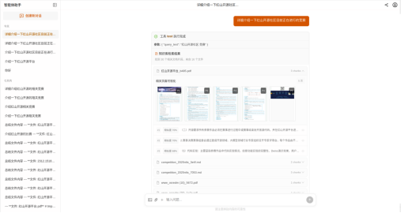

<div align="center">
  
</div>

<h1 align="center">StackSolve - 栈问速解</h1>

<div align="center">

[](https://github.com/yourusername/StackSolve/releases)
[](LICENSE)
[](docker-compose.yml)
[](https://www.python.org/)
[](https://vuejs.org/)

**基于大模型的智能知识库与知识图谱问答系统**

[功能特性](#-核心特性) • [快速开始](#-快速开始) • [文档](#-文档) • [贡献指南](#-参与贡献)

</div>

---

## 简介

**StackSolve - 栈问速解**是一个功能强大的智能问答平台，融合了 RAG 知识库与知识图谱技术，基于 LangGraph + Vue.js + FastAPI + LightRAG 架构构建。通过先进的文档解析、向量检索和图谱推理技术，为用户提供准确、全面的知识问答服务。

### 核心创新

在原项目基础上，我们重点增强了以下功能：

#### **Unstructured 非结构化文档处理**

- 智能识别文档结构（标题、段落、表格、图片等）
- 高精度表格提取和结构保持
- 支持复杂 PDF 文档的智能解析
- 自动提取文档元数据和层级关系

#### **多模态 RAG 系统**

- **图片理解**：支持上传图片并使用视觉语言模型（VL Model）进行分析
- **图文混合对话**：在对话中同时处理文本和图像信息
- **多模态检索**：结合文本和视觉特征的知识检索
- **文件附件处理**：智能提取 PDF、Word、Excel 等文件内容并转换为上下文

#### **Web 界面增强**

- **可视化知识库管理**：直观的知识库创建、编辑和查看界面
- **文档预览与标注**：在线预览文档内容，支持 Unstructured 结果可视化
- **交互式图谱展示**：Neo4j 知识图谱的 Web 可视化
- **实时对话界面**：流畅的多模态对话体验

### 核心特性

- **智能对话** - 支持主流大模型（OpenAI、DeepSeek、硅基流动等），集成 vLLM、Ollama 本地部署
- **灵活知识库** - 支持 LightRAG、Milvus、Chroma 等多种向量存储，配备 MinerU、PP-Structure-V3、**Unstructured** 文档解析引擎
- **知识图谱** - 支持 LightRAG 自动图谱构建和 Neo4j 自定义图谱问答，可接入现有知识图谱，Web 可视化展示
- **多模态 RAG** - **图文混合检索**，支持图片上传、视觉语言模型分析、文件附件智能提取
- **非结构化处理** - **Unstructured 引擎**，智能识别文档结构，高精度表格提取
- **Web 可视化** - **完整的知识库管理界面**，文档预览、图谱展示、实时对话
- **权限管理** - 三级权限体系（超级管理员、管理员、普通用户），支持内容审查和守卫模型
- **高度可定制** - 支持自定义智能体、品牌配置、主题配色

## 应用场景

- **企业知识库** - 构建企业内部知识管理和检索系统
- **教育培训** - 智能课程问答和学习辅助
- **科研文献** - 文献检索和知识发现
- **客户服务** - 智能客服和 FAQ 系统
- **数据分析** - 结合知识图谱的深度数据洞察

## 快速开始

### 系统要求

- **Docker & Docker Compose** - 容器化部署
- **8GB+ RAM** - 推荐 16GB 以上
- **可选**: NVIDIA GPU（用于本地 OCR 服务）

### 一键启动

1. **克隆项目**

   ```bash
   git clone https://github.com/yourusername/StackSolve.git
   cd StackSolve
   ```

2. **配置环境变量**

   ```bash
   cp src/.env.template src/.env
   # 编辑 src/.env，配置必需的 API Key
   ```

   **必需配置**（推荐使用硅基流动免费服务）：

   ```env
   SILICONFLOW_API_KEY=sk-your-api-key-here
   ```

   > 💡 [免费获取 SiliconFlow API Key](https://cloud.siliconflow.cn)（注册即送额度）

3. **启动服务**

   ```bash
   docker compose up -d
   ```

4. **访问系统**

   - **前端界面**: http://localhost:5173
   - **API 文档**: http://localhost:5050/docs
   - **Neo4j 浏览器**: http://localhost:7474 (用户名: `neo4j`, 密码: `0123456789`)
   - **MinIO 控制台**: http://localhost:9001

5. **停止服务**

   ```bash
   docker compose down
   ```

## 界面预览

<div align="center">
  
</div>

## 核心功能

### 1. 知识库管理

支持多种知识库类型：

- **LightRAG** - 轻量级 GraphRAG，自动构建知识图谱
- **Milvus** - 高性能向量数据库
- **Chroma** - 轻量级向量存储

**文档解析引擎**：

- **Unstructured** - 智能文档结构识别，支持复杂表格提取和元数据解析
- MinerU - 高精度 PDF 解析（需要 GPU）
- PP-Structure-V3 - PaddleOCR 结构化解析（需要 GPU）

### 2. 知识图谱

- **自动构建** - 基于 LightRAG 自动提取实体和关系
- **图谱检索** - 支持复杂图查询和路径分析
- **数据导入** - JSONL 格式批量导入
- **可视化** - Neo4j 图谱可视化展示

### 3. 智能对话与多模态 RAG 🌟

- **多轮对话** - 上下文理解和记忆
- **多模态理解** - 图片上传、视觉语言模型分析、图文混合对话
- **智能文件处理** - PDF、Word、Excel 等文件自动提取和上下文注入
- **多模态检索** - 结合文本和视觉特征的知识检索
- **工具调用** - 网页搜索、数据库查询等

### 4. 自定义智能体

基于 [LangGraph](https://github.com/langchain-ai/langgraph) 开发：

- **ChatBot** - 基础对话智能体
- **ReAct** - 推理行动智能体
- **DeepResearch** - 深度研究智能体
- **自定义** - 支持开发自己的智能体

## 🔧 高级配置

### 模型配置

支持多种 API 服务商：

| 服务商     | 环境变量              | 备注          |
| ---------- | --------------------- | ------------- |
| 硅基流动   | `SILICONFLOW_API_KEY` | 🆓 免费，推荐 |
| OpenAI     | `OPENAI_API_KEY`      |               |
| DeepSeek   | `DEEPSEEK_API_KEY`    |               |
| 智谱清言   | `ZHIPUAI_API_KEY`     |               |
| 阿里云百炼 | `DASHSCOPE_API_KEY`   |               |

### OCR 服务配置

**高级 OCR 服务**:

```bash
# MinerU (需要 CUDA 12.6+)
docker compose up mineru --build

# PaddleX (需要 CUDA 11.8+)
docker compose up paddlex --build
```

### 品牌定制

复制并编辑品牌配置文件：

```bash
cp src/config/static/info.template.yaml src/config/static/info.local.yaml
```

配置组织信息、Logo、配色等：

```yaml
organization:
  name: "您的组织名称"
  logo: "/logo.png"

branding:
  name: "系统名称"
  title: "系统标题"
```

## 📦 项目结构

```
StackSolve/
├── docker/              # Docker 配置
├── server/              # FastAPI 后端
│   ├── routers/         # API 路由
│   └── utils/           # 工具函数
├── src/                 # 核心源代码
│   ├── agents/          # 智能体应用
│   ├── config/          # 配置管理
│   ├── knowledge/       # 知识库实现
│   ├── models/          # 模型接口
│   ├── processors/         # 插件（OCR等）
│   └── utils/           # 工具函数
├── web/                 # Vue.js 前端
│   ├── src/
│   │   ├── apis/        # API 接口
│   │   ├── components/  # Vue 组件
│   │   ├── views/       # 页面视图
│   │   └── stores/      # 状态管理
│   └── public/          # 静态资源
└── docker-compose.yml   # 服务编排
```

## 🔌 服务端口

| 端口      | 服务     | 说明             |
| --------- | -------- | ---------------- |
| 5173      | Web 前端 | 用户界面         |
| 5050      | API 后端 | FastAPI 服务     |
| 7474/7687 | Neo4j    | 图数据库         |
| 9000/9001 | MinIO    | 对象存储         |
| 19530     | Milvus   | 向量数据库       |
| 30000     | MinerU   | PDF 解析（可选） |
| 8080      | PaddleX  | OCR 服务（可选） |

## 文档

- [快速开始指南](docs/getting-started.md)
- [智能体开发](AGENTS.md)
- [API 文档](http://localhost:5050/docs)
- [常见问题](docs/faq.md)

## 开发指南

### 后端开发

```bash
# 进入容器
docker exec -it api-dev bash

# 运行测试
uv run pytest test/

# 代码检查
make lint

# 格式化代码
make format
```

### 前端开发

```bash
# 进入 web 目录
cd web

# 安装依赖
pnpm install

# 开发模式
pnpm run dev

# 构建生产版本
pnpm run build
```

## 参与贡献

我们欢迎所有形式的贡献！

1. Fork 本项目
2. 创建特性分支 (`git checkout -b feature/amazing-feature`)
3. 提交更改 (`git commit -m 'Add some amazing feature'`)
4. 推送到分支 (`git push origin feature/amazing-feature`)
5. 创建 Pull Request

## 许可证

本项目采用 MIT 许可证 - 查看 [LICENSE](LICENSE) 文件了解详情。

## 🙏 致谢

### 特别感谢

本项目基于 **[Yuxi-Know](https://github.com/xerrors/Yuxi-Know)** 进行深度二次开发，感谢 [@xerrors](https://github.com/xerrors) 创建了如此优秀的开源项目！

### 技术栈

- [LangGraph](https://github.com/langchain-ai/langgraph) - 智能体框架
- [LightRAG](https://github.com/HKUDS/LightRAG) - 轻量级 GraphRAG
- [FastAPI](https://fastapi.tiangolo.com/) - 现代 Web 框架
- [Vue.js](https://vuejs.org/) - 渐进式前端框架
- [Neo4j](https://neo4j.com/) - 图数据库
- [Milvus](https://milvus.io/) - 向量数据库

<div align="center">

**如果这个项目对您有帮助，请给我们一个 ⭐️**

[报告问题](https://github.com/yourusername/StackSolve/issues) • [功能请求](https://github.com/yourusername/StackSolve/issues) • [讨论](https://github.com/yourusername/StackSolve/discussions)

</div>
