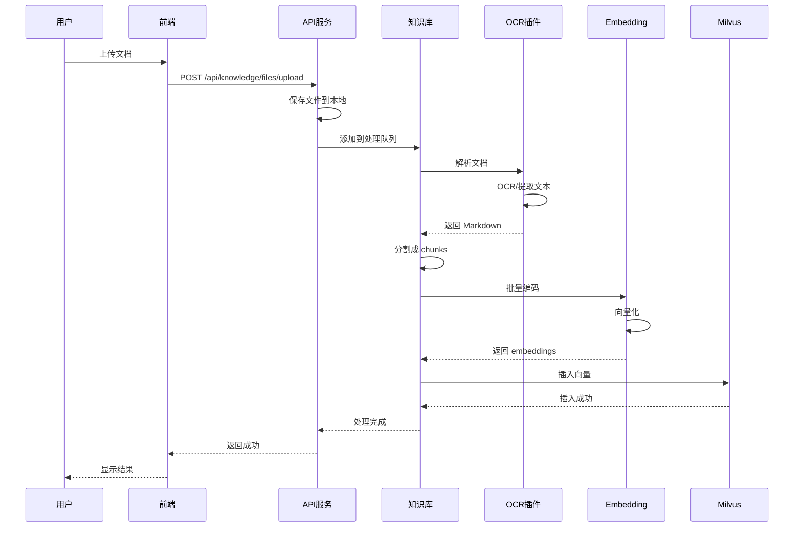
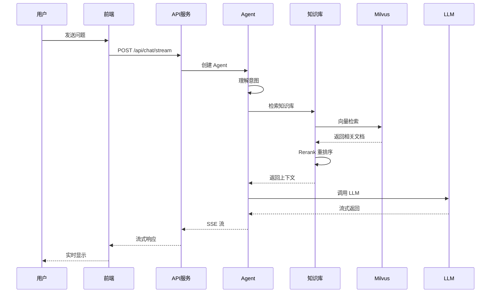
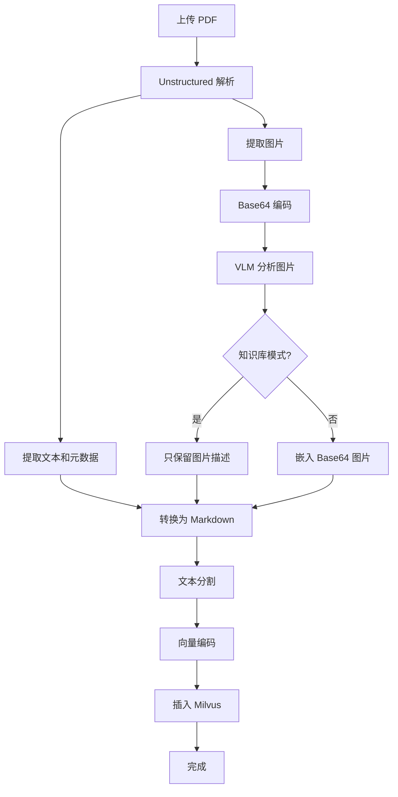

# StackSolve 系统架构详解

## 📋 目录
- [系统概述](#系统概述)
- [技术栈](#技术栈)
- [架构设计](#架构设计)
- [核心服务](#核心服务)
- [数据流程](#数据流程)
- [功能模块](#功能模块)
- [部署架构](#部署架构)

---

## 🎯 系统概述

**StackSolve（栈问速解）** 是一个基于知识图谱和向量数据库的智能知识库系统，集成了多种 AI 技术，提供智能问答、文档解析、知识检索等功能。

### 核心特性
- 🧠 **多模态知识库**：支持文本、图片、PDF、表格等多种格式
- 🔍 **混合检索**：结合向量检索和知识图谱
- 🤖 **智能 Agent**：支持 ReAct、Chatbot 等多种智能体
- 📊 **可视化展示**：文档结构可视化、知识图谱可视化
- 🔌 **插件化设计**：OCR、VLM、Guard 等可插拔模块

---

## 🛠 技术栈

### 后端技术
| 组件 | 技术 | 说明 |
|------|------|------|
| **Web 框架** | FastAPI | 高性能异步 Web 框架 |
| **向量数据库** | Milvus 2.5.6 | 分布式向量数据库 |
| **图数据库** | Neo4j | 知识图谱存储 |
| **对象存储** | MinIO | 文件存储 |
| **依赖管理** | UV | Python 包管理器 |
| **语言** | Python 3.12+ | 后端开发语言 |

### 前端技术
| 组件 | 技术 | 说明 |
|------|------|------|
| **框架** | Vue.js 3 | 前端 MVVM 框架 |
| **构建工具** | Vite | 下一代前端构建工具 |
| **UI 组件** | Ant Design Vue | UI 组件库 |
| **图标** | Lucide Vue / Ant Design Icons | 图标库 |
| **样式** | Less | CSS 预处理器 |

### AI 技术栈
| 组件 | 技术 | 说明 |
|------|------|------|
| **LLM** | 多模型支持 | 支持 OpenAI、Ollama 等 |
| **Embedding** | BGE-M3 等 | 多种向量编码模型 |
| **OCR** | Unstructured/PaddleOCR/MinerU | 文档解析 |
| **VLM** | Vision Language Model | 图片理解 |
| **Agent 框架** | LangChain/LangGraph | 智能体框架 |

---

## 🏗 架构设计

### 整体架构图

```
┌─────────────────────────────────────────────────────────────┐
│                         前端层 (Vue.js)                        │
│  ┌──────────┐  ┌──────────┐  ┌──────────┐  ┌──────────┐    │
│  │ 知识库页面 │  │ 对话页面  │  │ 可视化页面 │  │ 系统设置  │    │
│  └──────────┘  └──────────┘  └──────────┘  └──────────┘    │
└─────────────────────────────────────────────────────────────┘
                              ▼
┌─────────────────────────────────────────────────────────────┐
│                      API 网关 (Nginx)                         │
└─────────────────────────────────────────────────────────────┘
                              ▼
┌─────────────────────────────────────────────────────────────┐
│                    后端服务层 (FastAPI)                        │
│  ┌──────────────┐  ┌──────────────┐  ┌──────────────┐      │
│  │ Knowledge    │  │ Chat         │  │ Graph        │      │
│  │ Router       │  │ Router       │  │ Router       │      │
│  └──────────────┘  └──────────────┘  └──────────────┘      │
│  ┌──────────────┐  ┌──────────────┐  ┌──────────────┐      │
│  │ Auth         │  │ System       │  │ Dashboard    │      │
│  │ Router       │  │ Router       │  │ Router       │      │
│  └──────────────┘  └──────────────┘  └──────────────┘      │
└─────────────────────────────────────────────────────────────┘
                              ▼
┌─────────────────────────────────────────────────────────────┐
│                        业务逻辑层                              │
│  ┌──────────────┐  ┌──────────────┐  ┌──────────────┐      │
│  │ Knowledge    │  │ Agent        │  │ Model        │      │
│  │ Manager      │  │ System       │  │ Manager      │      │
│  └──────────────┘  └──────────────┘  └──────────────┘      │
│  ┌──────────────┐  ┌──────────────┐  ┌──────────────┐      │
│  │ Plugin       │  │ Storage      │  │ Utils        │      │
│  │ System       │  │ Manager      │  │              │      │
│  └──────────────┘  └──────────────┘  └──────────────┘      │
└─────────────────────────────────────────────────────────────┘
                              ▼
┌─────────────────────────────────────────────────────────────┐
│                        数据存储层                              │
│  ┌──────────┐  ┌──────────┐  ┌──────────┐  ┌──────────┐    │
│  │ Milvus   │  │ Neo4j    │  │ MinIO    │  │ SQLite   │    │
│  │ (向量)    │  │ (图谱)    │  │ (文件)    │  │ (元数据)  │    │
│  └──────────┘  └──────────┘  └──────────┘  └──────────┘    │
└─────────────────────────────────────────────────────────────┘
```

### 核心设计模式

#### 1. **分层架构**
```
表现层 (Presentation Layer)
   ↓
路由层 (Router Layer)
   ↓
业务层 (Business Logic Layer)
   ↓
数据层 (Data Access Layer)
```

#### 2. **插件化设计**
```python
# 插件系统架构
src/processors/
├── _ocr.py          # OCR 插件基类
├── mineru.py        # MinerU OCR 实现
├── paddlex.py       # PaddleX OCR 实现
└── guard.py         # 内容审核插件
```

#### 3. **工厂模式**
```python
# 知识库工厂
src/knowledge/factory.py
- create_knowledge_base()  # 根据类型创建知识库实例
  - MilvusKB
  - ChromaKB
  - LightRAG
```

---

## 🔧 核心服务

### 1. **API 服务 (api-dev)**

FastAPI 后端服务，提供 RESTful API。

**主要路由模块：**

| 路由 | 文件 | 功能 |
|------|------|------|
| `/api/knowledge/*` | `knowledge_router.py` | 知识库管理 |
| `/api/chat/*` | `chat_router.py` | 对话交互 |
| `/api/graph/*` | `graph_router.py` | 知识图谱 |
| `/api/auth/*` | `auth_router.py` | 用户认证 |
| `/api/system/*` | `system_router.py` | 系统配置 |

**核心功能：**
- 📤 文件上传与处理
- 🔍 向量检索与 Rerank
- 🤖 Agent 对话管理
- 📊 知识图谱操作
- 👤 用户权限管理

### 2. **前端服务 (web-dev)**

Vue.js 前端开发服务器，提供用户界面。

**目录结构：**
```
web/src/
├── views/          # 页面视图
│   ├── KnowledgeBase.vue
│   ├── ChatPage.vue
│   └── GraphVisualization.vue
├── components/     # 组件
│   ├── FileDetailModal.vue
│   ├── AgentMessageComponent.vue
│   └── ToolCallingResult/
├── apis/          # API 接口定义
├── stores/        # 状态管理
└── utils/         # 工具函数
```

### 3. **Milvus 向量数据库**

分布式向量数据库，用于语义检索。

**配置：**
```yaml
version: v2.5.6
端口: 19530
依赖服务:
  - etcd (元数据存储)
  - MinIO (对象存储)
```

**主要功能：**
- 向量存储与检索
- 相似度搜索
- 集合管理
- 自动持久化

### 4. **Neo4j 图数据库**

知识图谱存储，支持复杂关系查询。

**配置：**
```yaml
端口: 7474 (HTTP), 7687 (Bolt)
用户: neo4j
```

**应用场景：**
- 知识图谱构建
- 关系推理
- 图可视化

### 5. **MinIO 对象存储**

文件存储服务，管理上传文件和生成的数据。

**配置：**
```yaml
端口: 9000 (API), 9001 (Console)
存储路径: docker/volumes/minio/
```

**存储内容：**
- 上传文档
- 解析结果
- 可视化数据
- 模型文件

### 6. **OCR 服务（可选）**

文档解析服务，支持多种 OCR 引擎。

**可选服务：**
- **mineru** - GPU 加速的高性能 OCR
- **paddlex** - PaddlePaddle OCR 服务

---

## 🔄 数据流程

### 文档上传流程



### 对话检索流程



### Unstructured PDF 处理流程



---

## 📦 功能模块

### 1. **知识库模块** (`src/knowledge/`)

**核心类：**
- `KnowledgeBase` - 知识库基类
- `MilvusKB` - Milvus 实现
- `ChromaKB` - Chroma 实现
- `LightRAGKB` - LightRAG 实现

**主要功能：**
```python
# 知识库操作
- create_database()      # 创建知识库
- add_content()          # 添加文档
- search()              # 检索
- delete_document()     # 删除文档
- get_database_info()   # 获取信息
```

### 2. **Agent 模块** (`src/agents/`)

**智能体类型：**

| Agent | 说明 | 特点 |
|-------|------|------|
| **Chatbot** | 通用对话 | 简单快速，适合日常对话 |
| **ReAct** | 推理行动 | 支持工具调用，复杂任务 |

**工具系统：**
```python
# 可用工具
- knowledge_base_search()  # 知识库检索
- web_search()            # 网络搜索
- calculator()            # 计算器
- python_repl()          # Python 执行
```

### 3. **模型管理** (`src/models/`)

**模型类型：**

| 类型 | 文件 | 说明 |
|------|------|------|
| **Chat** | `chat.py` | LLM 对话模型 |
| **Embed** | `embed.py` | 向量编码模型 |
| **Rerank** | `rerank.py` | 重排序模型 |

**支持的模型提供商：**
- OpenAI
- Ollama
- SiliconFlow
- 其他兼容 OpenAI API 的服务

### 4. **OCR 插件** (`src/processors/`)

**OCR 引擎：**

| 引擎 | 特点 | 适用场景 |
|------|------|---------|
| **Unstructured** | 结构化提取 | 复杂文档、表格 |
| **MinerU** | GPU 加速 | 大批量处理 |
| **PaddleX** | 高精度 | 中文文档 |

**关键优化：**
```python
# 知识库模式：不嵌入 base64 图片
include_base64_images = False  # 默认关闭
# 效果：chunk 数量减少 99%+
```

### 5. **存储模块** (`src/storage/`)

**存储类型：**

| 类型 | 实现 | 说明 |
|------|------|------|
| **对话存储** | SQLite | 保存对话历史 |
| **数据库** | SQLite | 元数据管理 |
| **MinIO** | S3 协议 | 文件对象存储 |

---

## 🚀 部署架构

### Docker Compose 编排

```yaml
services:
  # 核心服务
  api-dev:      # FastAPI 后端
  web-dev:      # Vue.js 前端
  
  # 存储服务
  graph:        # Neo4j 图数据库
  milvus:       # Milvus 向量库
  milvus-etcd:  # etcd 协调服务
  milvus-minio: # MinIO 对象存储
  
  # 可选服务
  mineru:       # MinerU OCR (需 GPU)
  paddlex:      # PaddleX OCR (需 GPU)
  
  # 反向代理
  nginx:        # Nginx (生产环境)
```

### 服务依赖关系

```
api-dev
  ├── milvus
  │   ├── milvus-etcd
  │   └── milvus-minio
  ├── graph (neo4j)
  ├── mineru (可选)
  └── paddlex (可选)

web-dev
  └── api-dev (通过 proxy)
```

### 开发模式特性

**热重载支持：**
- ✅ 后端代码修改自动重载（FastAPI）
- ✅ 前端代码修改自动刷新（Vite HMR）
- ✅ 无需重启容器

**数据持久化：**
```
docker/volumes/
├── milvus/        # Milvus 数据
├── neo4j/         # Neo4j 数据
└── minio/         # MinIO 数据

saves/
├── knowledge_base_data/  # 知识库数据
├── database/            # SQLite 数据库
└── logs/               # 日志文件
```

---

## 🔐 安全设计

### 认证与授权
- JWT Token 认证
- 用户权限管理
- API 访问控制

### 数据安全
- 敏感信息环境变量配置
- 文件上传安全检查
- SQL 注入防护

### 内容审核
- Guard 插件支持
- 敏感内容过滤

---

## 📊 监控与日志

### 日志系统
```python
# 统一日志配置
src/utils/logging_config.py

# 日志级别
- DEBUG: 调试信息
- INFO: 重要流程
- WARNING: 警告信息
- ERROR: 错误信息
```

### 性能监控
- API 响应时间
- 向量检索性能
- 模型调用统计

---

## 🎨 前端架构

### 状态管理
```javascript
// Pinia stores
stores/
├── knowledgeStore.js    // 知识库状态
├── chatStore.js         // 对话状态
├── userStore.js         // 用户状态
└── configStore.js       // 配置状态
```

### API 调用规范
```javascript
// 所有 API 继承自 apiGet/apiPost/apiRequest
web/src/apis/
├── knowledge.js
├── chat.js
├── auth.js
└── system.js
```

### UI 设计原则
- 🎨 简洁一致的视觉风格
- 🌈 统一的颜色系统 (base.css)
- 📱 响应式布局
- ⚡ 流畅的交互体验

---

## 🔄 扩展性设计

### 插件系统
- 📦 OCR 插件可扩展
- 🧩 工具插件可扩展
- 🔌 存储后端可扩展

### 模型支持
- 🤖 多 LLM 提供商
- 🔢 多 Embedding 模型
- 🎯 多 Rerank 模型

### 知识库类型
- ✅ Milvus (向量)
- ✅ Chroma (向量)
- ✅ LightRAG (图+向量)
- 🔄 可添加更多实现

---

## 📝 总结

StackSolve 采用了现代化的微服务架构，具有以下优势：

✅ **高性能**：异步处理、向量检索、GPU 加速
✅ **可扩展**：插件化设计、工厂模式、模块化架构
✅ **易维护**：分层架构、代码规范、文档完善
✅ **用户友好**：流式响应、可视化、热重载开发

系统通过 Docker Compose 实现一键部署，支持开发和生产环境的灵活切换。

